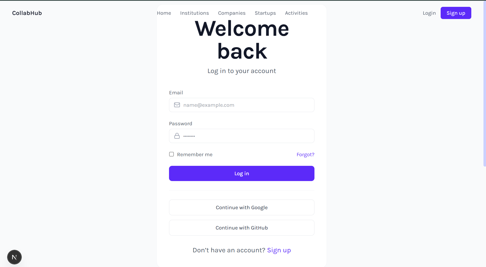
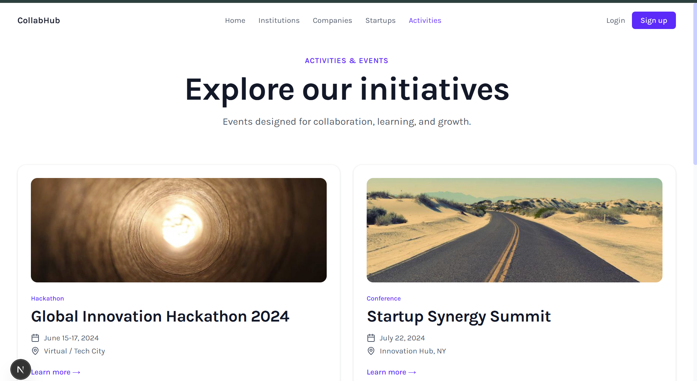

# 🚀 CollabHub

A modern collaboration platform that bridges the gap between Students, Educational Institutions, Startups, and Companies through innovation, networking, mentorship, internships, and real-world opportunities.

---

## 📖 Overview

CollabHub is designed to create a collaborative ecosystem where:

- 🎓 Students gain practical industry exposure.
- 🏫 Institutions connect with companies and startups.
- 🚀 Startups access talent, mentorship, and networking.
- 🏢 Companies discover skilled candidates and innovation opportunities.

The platform offers a clean, modern, and responsive interface built using the latest web technologies.

---

## ✨ Features

### Home Page

- Modern Hero Section
- Responsive Navigation
- Collaboration-focused Platform Overview
- Call-To-Action Buttons
- Smooth User Experience

### Authentication

- Login Page
- Sign Up Interface
- Social Authentication UI
- User-Friendly Form Design

### Institutions Module

- Academic Collaboration Features
- Internship Opportunities
- Research Partnerships
- Workshops & Certifications

### Startups Module

- Talent Discovery
- Startup Growth Support
- Mentorship Opportunities
- Networking Access

### Activities & Events

- Hackathons
- Conferences
- Innovation Challenges
- Learning Events
- Community Engagement

### Additional Sections

- Mentor Showcase
- Achievements Section
- Testimonials
- Brand Partnerships
- Recognition Section

---

## 🛠️ Tech Stack

### Frontend

- Next.js 15
- React 19
- TypeScript
- Tailwind CSS
- Framer Motion
- Lucide React

### Development Tools

- ESLint
- PostCSS
- npm

---

## 📂 Project Structure

```text
collabhub/
│
├── app/
│   ├── about/
│   ├── activities/
│   ├── companies/
│   ├── institutions/
│   ├── login/
│   ├── startups/
│   ├── components/
│   │   ├── home/
│   │   └── layout/
│   │
│   ├── globals.css
│   ├── layout.tsx
│   └── page.tsx
│
├── public/
├── screenshots/
├── package.json
├── tsconfig.json
└── README.md
```

---

## 📸 Screenshots

### Home Page


---

### Login Page



---

### Institutions Page


---

### Startups Page


---

### Activities & Events



---

## 🚀 Installation

Clone the repository:

```bash
git clone https://github.com/YPragnavi/collabhub.git
```

Navigate into the project:

```bash
cd collabhub
```

Install dependencies:

```bash
npm install
```

Run the development server:

```bash
npm run dev
```

Open:

```text
http://localhost:3000
```

---

## 🔨 Build for Production

```bash
npm run build
```

---

## ▶️ Start Production Server

```bash
npm start
```

---

## 🎯 Future Enhancements

- User Authentication Backend
- Role-Based Access Control
- Internship Management System
- Startup Dashboard
- Institution Dashboard
- Company Dashboard
- Real-Time Messaging
- AI-Based Opportunity Recommendations
- Event Registration System
- Notification Center

---

## 👩‍💻 Author

### Y. Pragnavi

Full Stack Developer
